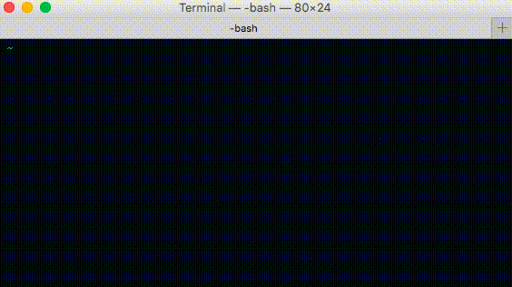

# sw

[](https://travis-ci.org/komondor/sw)


- this module requires [node-gyp](https://github.com/nodejs/node-gyp)
- windows and mac

#### then, install globally:

```bash
npm install sw -g
```

#### usage:

```bash
$ sw folder [[subf1][subf2][...]]      
```

to point to the home directory, use ":"

```bash
$ sw : desktop
```

to point to the parent directory, use ".." :

```bash
$ sw .. .. .. whatever (same as cd ../../../whatever)
```


#### example:

to point to folder location: '~/desktop/folder1/folder2' :

```bash
$ sw :  desk r1 r2
```

if there is only one match, then it will perform:

```bash
$ cd ~/desktop/folder1/folder2
```

if there are 2 or more matches, it will prompt to choose the location


if you don't start the command with":", it will start from './'


